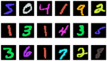

# VAE Latent Spaces

This project explores three Variational Autoencoder (VAE) models with different types of latent spaces: continuous, discrete, and a combination of both. The implementation allows for flexibility in designing the model, such as sharing or not sharing encoder weights and handling convolutional operations with nn.ConvTranspose2d. The MNIST dataset is used with a unique twist - each sample is randomly colored with a different color. Visualization of generated images and latent spaces is performed, comparing different architectures. The control of color and digit in the generated samples is discussed, evaluating the effectiveness of various model designs.
## Implementation

### Background: 

#### VAE

Variational Autoencoder (VAE) is a generative model that learns to encode and decode data, particularly useful for generating new samples. It introduces a probabilistic approach to latent space, allowing for randomness and continuity in representations. The encoder maps input data to a distribution in latent space, and the decoder generates samples by sampling from this distribution. VAEs are effective for generating diverse and realistic data while providing a structured latent space for interpolation and exploration.

### The models:

(i) **Continuous Latent Model:** In the continuous VAE, input is mapped to mean $\mu(x)$ and standard deviation $\sigma(x)$ vectors using reparameterization trick, resulting in a normal distribution $z \sim N(\mu, \sigma)\$. This enhances decoder robustness.

(ii) **Discrete Latent Model:** The discrete VAE addresses categorical structures (e.g., text, graphs) using Gumbel SoftMax reparameterization. Adjusting parameters (N=6, K=25) improved expressiveness and perceptible differences in digit colors. PCA aids in 2D visualization.

(iii) **Combined Model:** The combined VAE aims to leverage advantages from both continuous and discrete models, enhancing the ability to capture intricate data relationships. Using N=5, K=65 for the discrete part and concatenating latent vectors from both models. The loss is a sum of losses from the continuous and discrete models.

### The Dataset
MNIST, a widely used dataset for machine learning, comprises 28x28 grayscale images of handwritten digits (0-9). It's a benchmark for classification algorithms, particularly in image recognition. The provided code introduces a custom class that enhances MNIST by randomly changing the colors of its images, offering an augmented dataset for more diverse and versatile model training and evaluation.

## Results

**Latent Space:**
It's interesting to observe the value ranges in the latent space. The continuous model ranges between (-4, 6), the discrete between (-100, 150), and the combined exhibits an expected blend, resembling both continuous and discrete distributions.

**Reconstructed:**
As expected, the combined model demonstrates greater expressiveness compared to the continuous and discrete models. It clearly represents digits and their corresponding colors, unlike the slightly blurred representation in the continuous and discrete models. In the discrete model, distinguishing colors or digits is slightly more challenging. Controlling color and digits in the generated images is examined through the latent space of the continuous model. For the range (-2, 2), corresponding to colors and digits, distinct representations are observed in the reconstructed images. For instance, digits 1 (orange), 6 (pink), and 9 (blue) are clearly discernible. The reconstructed images within this range align well with the intended colors and digits. In contrast, achieving such control in the continuous and combined models is more challenging due to a more dispersed latent space, evident in the compressed and fuller latent space appendices.

Overall, the combined model provides a balance, capturing intricate relationships, while the continuous model allows for more precise control in specific ranges.

